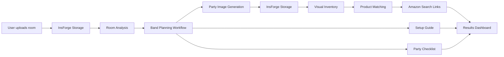

# Scene 🎈

**See your party before you buy a thing.** Upload a photo of your actual room, describe the party, and Scene shows you the finished setup in *that* room — then matches every decoration in the image to a real Amazon search, a budget, a room-specific setup guide, and a planning checklist.

Powered by **InsForge** (storage, database, model gateway) + **Band** (multi-agent planning workflow).

---

## 1 · The user problem

Party decorating is bought blind. People spend real money on balloons, backdrops, and tablescapes with no idea how it will look in *their* space, and Pinterest inspiration photos are someone else's room. Scene closes that gap: you see your own room finished before you spend a dollar, and everything you see is shoppable.

## 2 · How Scene works

Upload your room → describe your party → see the completed vision → shop the matching look → follow the setup plan.

The results dashboard shows: a before/after slider of your room, a grouped "Shop this look" section with live Amazon search buttons and visual match scores, a budget summary with filtering controls, a setup guide written for your specific room, and a checkable party checklist.

## 3 · The room-image transformation pipeline

This is the core feature. The uploaded photo is passed **as an input image** to an image-editing model through the InsForge Model Gateway (the OpenAI-compatible `/api/ai/chat/completions` endpoint with the room photo attached as an input image and `modalities: ["image", "text"]`, default model `google/gemini-3-pro-image-preview`). The prompt explicitly instructs the model to preserve the room's architecture, perspective, camera angle, walls, flooring, windows, doors, and recognizable furniture, and to add only realistic, purchasable decorations — never to replace the room with a different venue. The prompt is enriched with the Party Designer agent's decoration plan so the edit and the shopping list describe the same design.

## 4 · How the visual inventory is generated

After generation, Scene looks at the **generated image** (not the user's form) with a vision model via the Model Gateway, producing a factual list of every visible decoration. The Band **Visual Inventory Agent** structures that into JSON: name, category, colors, style, material, size, quantity, a precise search query, importance, and room location. The shopping list is therefore grounded in what actually appears in the visualization.

## 5 · How products are matched to the final vision

The Band **Shopping Match Agent** takes the inventory and assigns each item a realistic USD price and a **match score (0–100)** weighing six consistent factors: color similarity, category match, style match, size suitability, budget fit, and importance to the final design. Scores are AI-estimated for the MVP but produced from one rubric in one pass so they're internally consistent; the score renders as "94% visual match" on each product card.

## 6 · How Amazon links are created

Each inventory item carries a precise search query built from its visual attributes ("sage green gold white balloon arch kit 120 piece", never "party decoration"). The server URL-encodes it into `https://www.amazon.com/s?k=ENCODED_QUERY` (`backend/amazon.py`). Buttons open real Amazon search result pages; there is no scraping.

## 7 · How Band powers the agent workflow

Band is the coordination layer for the planning pipeline. Six identities live on the Band platform:

| Agent | Role |
|---|---|
| **SceneOrchestrator** | The Scene server itself, acting through Band's documented Agent API |
| **SceneAnalyst** | Room Analysis Agent — structures the room description into analysis JSON |
| **SceneDesigner** | Party Designer Agent — creates the decoration plan for this room |
| **SceneInventory** | Visual Inventory Agent — structures decorations seen in the generated image |
| **SceneShopper** | Shopping Match Agent — prices and scores every product |
| **ScenePlanner** | Setup Planner Agent — writes the room-specific setup guide + checklist |

All six share one Band chat room. For each stage the orchestrator posts a message **@mentioning** the specialist (Band routes on mentions), including a per-project marker like `[scene:ab12cd34]`. The specialist — a Python process built on the Band SDK's documented `AnthropicAdapter` pattern (`band_agents/agents.py`) — wakes on the mention, reasons with Claude, and replies to `@SceneOrchestrator` with the marker plus pure JSON. The server collects replies through Band's documented processing queue (`GET /messages/next` → `POST /processing` → `POST /processed`), which also gives crash recovery for free. Division of labor: **perception** (seeing images) runs on the InsForge Model Gateway; **reasoning** runs as Band agents. Every Band output is saved to InsForge so results reload. The "See how Scene planned this party" panel on the dashboard shows each completed stage and the agent that produced it.

If a Band stage times out or errors, that stage falls back to a direct Model Gateway call with the same prompt — one flaky agent never erases a party.

## 8 · How InsForge powers storage, data, server operations, and AI access

- **Storage**: `room-images` bucket holds originals, `generated-images` holds AI results (`POST /api/storage/buckets/{bucket}/objects`); both URLs are what the dashboard slider renders.
- **Database**: `party_projects`, `party_products`, `party_tasks` (schema in `insforge/schema.sql`) store the project, matched products, and checkable tasks; checklist toggles persist.
- **Model Gateway**: one InsForge-managed key routes every AI call — vision analysis of both images, the image-to-image party generation, and the local fallback for any Band stage. No provider keys ever reach the app.
- **Server operations**: all InsForge and Band calls happen server-side in Flask via InsForge's documented REST API (PostgREST database records, storage objects, and the OpenAI-compatible AI endpoint); the browser never sees a credential.

## 9 · The demo fallback

`DEMO_MODE=true` (the default) serves a complete, clearly-labeled sample experience — a matched before/after room pair, a 10-item image-grounded product list with working Amazon buttons, budget summary, 7-step setup guide, and a 12-task checklist — with zero external calls. In live mode, every stage has try/catch, timeouts, and a fallback, and a fatal error returns the user to the wizard with a friendly message plus the demo path. Judges can never hit a blank result screen.

## 10 · Setup instructions

```bash
# Phase 1 — demo experience (no accounts needed) — Windows PowerShell
pip install -r requirements.txt
copy .env.example .env      # DEMO_MODE=true by default (Mac/Linux: cp)
python app.py               # → http://localhost:3000  → click "Try the demo"

# Phase 2 — InsForge (live generation)
npx @insforge/cli login
npx @insforge/cli link      # link this directory to your project
# create PUBLIC buckets room-images and generated-images, apply insforge/schema.sql
# (the CLI installs InsForge agent skills for db/storage; or use the dashboard)
# then in .env: DEMO_MODE=false, INSFORGE_BASE_URL, INSFORGE_ANON_KEY
python app.py

# Phase 3/4 — Band agents
# 1. At https://app.band.ai/agents create 6 Remote Agents:
#    SceneOrchestrator, SceneAnalyst, SceneDesigner, SceneInventory, SceneShopper, ScenePlanner
# 2. Create ONE chat room in the Band UI, add all six as participants, copy the room id.
# 3. Fill .env (BAND_ENABLED=true, orchestrator key, room id, specialist ids/names)
#    and band_agents/agent_config.yaml (copy the .example).
cd band_agents
uv init && uv add "band-sdk[anthropic]" python-dotenv
uv run python agents.py     # keep running in its own terminal
```

**What you should see** — Phase 1: server banner `Demo mode: ON`, the demo dashboard renders with confetti. Phase 2: banner shows `InsForge: connected`; uploading a photo logs `[InsForge Storage] uploaded ...` and the pipeline stages stream in the loading view. Phase 3/4: banner shows `Band: enabled`; agents log `Starting scene_analyst ...`; server logs `[Band] → @SceneDesigner` / `[Band] ← reply from SceneDesigner` per stage.

## 11 · Environment variables

See `.env.example` — every variable is documented inline. Nothing is hardcoded; `.env` and `band_agents/agent_config.yaml` are gitignored.

## 12 · Deployment

The app is a single Python process (Flask serves both the API and `web/`). Any Python 3.10+ host works: `pip install -r requirements.txt`, set the `.env` values as host environment variables, and run `python app.py` (or gunicorn for production: `gunicorn -w 2 -b 0.0.0.0:3000 app:app`). The Band specialist crew (`band_agents/agents.py`) runs as a second long-lived process — a small VM, container, or your laptop during judging is fine; if it's down, Scene degrades gracefully to Model Gateway fallbacks. The frontend can also be split out to InsForge Sites with the API deployed separately if preferred.

## 13 · Future improvements

Multiple vision variants to pick from; InsForge Auth so projects follow an account; InsForge Realtime to stream stage progress instead of polling; sponsor product-search APIs for direct product links with live prices; per-room decoration edit loop ("more balloons, fewer flowers"); Band agents negotiating trade-offs (Shopper pushing back on Designer when over budget).

## AI Architecture

Two sponsor platforms, two jobs. **InsForge** is the substance: it stores both images, persists every result, and is the single gateway through which all models are called — including the image-editing model that performs the room transformation. **Band** is the mind: the five-stage planning workflow is a real multi-agent collaboration in a shared Band room, coordinated by @mention routing and Band's processing queue, visible to judges in the "See how Scene planned this party" panel and in the Band room's own chat history during the demo.


